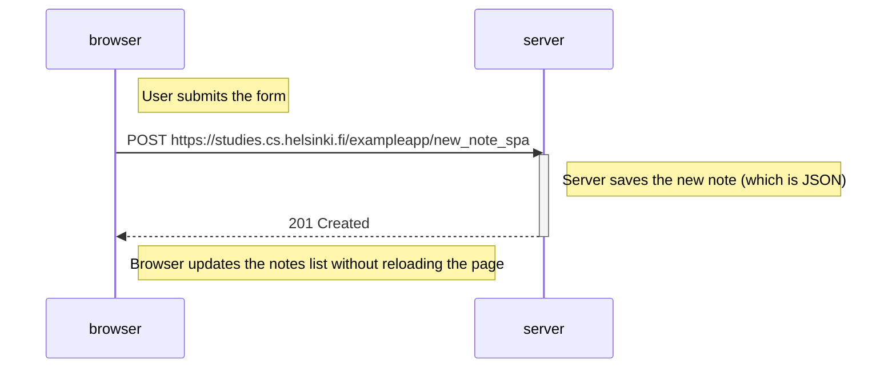

```mermaid
sequenceDiagram
    participant browser
    participant server
    
    Note right of browser: User submits the form

    browser->>server: POST https://studies.cs.helsinki.fi/exampleapp/new_note_spa 
    activate server
    Note right of server: Server saves the new note (which is JSON)
    server-->>browser: 201 Created
    deactivate server

    Note right of browser: Browser updates the notes list without reloading the page
```
